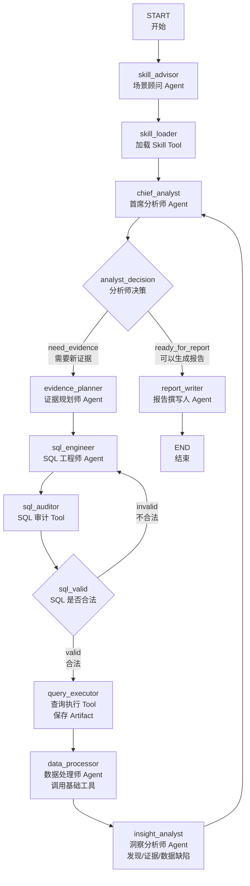

# DeepInsight2.0

## 1、数据分析流程

## 2、场景顾问：SkillAdvisorNode

根据用户的询问来选择合适的Skill

**输入：**

1. question：用户提问
2. 所有可用的SKILL信息，包括名字和描述

**输出**

1. selected_skill_name：选择的SKILL名字
2. skill_selection：这么做的原因

## 3、首席分析师：ChiefAnalystNode

用于控制多轮分析循环

**输入：**

1. question：用户提问
2. skill：之前选中的skill信息
3. analysis_round：当前是第几轮分析
4. max_analysis_rounds：预设定的最大分析轮数
5. finding_board：已经分析过的内容，用于判断是否足够生成报告
6. insight_result：上一轮洞察分析结果
7. data_issues：数据缺陷，第一轮为空

**输出**

1. chief_decision：这一轮的输出，留作记录
2. director_action：下一步的目标，是生成报告还是继续分析
3. analysis_goal：分析目标

## 4、证据规划师：EvidencePlannerNode

负责把总分析师的分析目标转化为所需的数据指标

**输入：**

1. question：用户提问
2. analysis_goal：分析目标
3. schema_info：数据库表结构
4. skill：之前选中的skill信息
5. finding_board：已经分析过的内容
6. analysis_round：当前是第几轮分析

**输出**

1. current_query_id：当前的证据任务编号，格式为：q00x

2. evidence_plan：针对分析目标的规划，包括需要的指标，该如何获取数据等

3. sql_attempts：SQL尝试生成次数

   

## 5、SQL工程师：**SQLEngineerNode** 

负责从数据库中拿数据

**输入：**

1. question：用户提问
2. analysis_goal：分析目标
3. evidence_plan：针对分析目标的规划
4. schema_info：数据库表结构
5. skill：之前选中的skill信息
6. audit_message：SQL审计失败返回来的信息
7. sql_attempts：SQL尝试生成次数

**输出**

1. sql：生成的SQL语句，用于查询数据
2. sql_attempts：SQL尝试生成次数

## 6、数据处理师：**DataProcessorNode**

负责对查询到的数据进行处理

**输入：**

1. analysis_goal：分析目标
2. evidence_plan：针对分析目标的规划
3. result_columns：现有数据的列名
4. result_row_count：现有数据的行数
5. result_truncated：
6. result_preview：数据的概览
7. result_path：数据保存的路径
8. skill：之前选中的skill信息

**输出**

1. processed_data：数据处理结果，包括数据缺陷

## 7、洞察分析师： **InsightAnalystNode**

**输入：**

1. question：用户提问
2. analysis_goal：分析目标
3. evidence_plan：针对分析目标的规划
4. processed_data：数据处理结果，包括数据处理后的文件路径、数据缺陷等
5. finding_board：已经分析过的内容
6. skill：之前选中的skill信息
7. current_query_id：当前的证据任务编号，格式为：q00x
8. result_path：数据保存的路径
9. data_issues：数据缺陷

